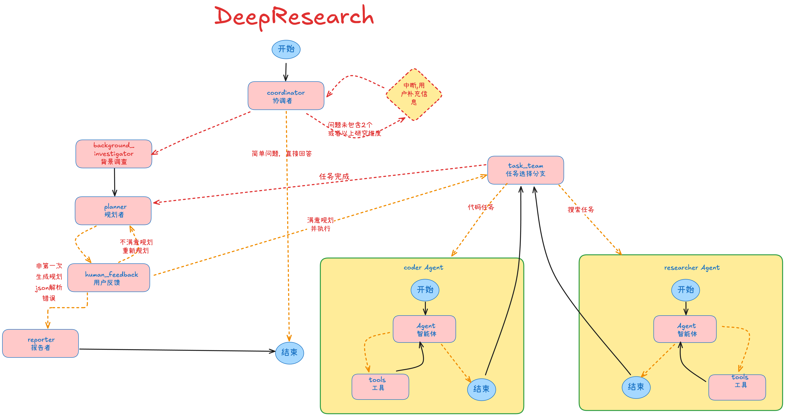
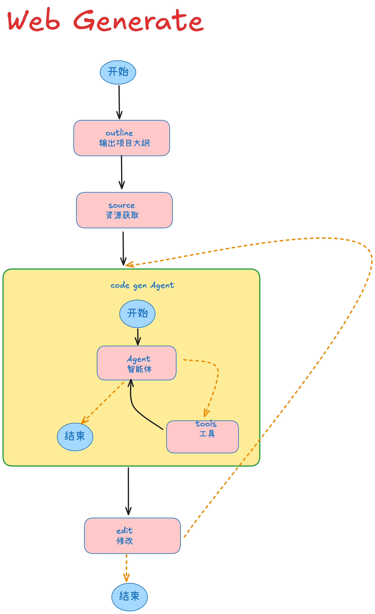

# Craft-Agent

> 📺 **Craft-Agent** 是一个集「深度研究助手」与「一键建站引擎」于一体的智能体系统，基于大语言模型、多智能体编排与现代 Web 技术栈构建。

- 深度研究：自动规划、搜索、阅读与整理资料，生成结构化研究报告
- 网站生成：将研究成果或你的想法，一键转化为可预览的前端网站
- 现代前后端架构：FastAPI + LangGraph/LangChain 后端，Next.js + TypeScript + shadcn/ui 前端

---

## 功能特性

- **多步深度研究工作流**  
  - 自动规划研究步骤，按步骤检索/阅读/汇总信息  
  - 支持人类在环（Human-in-the-loop）微调研究计划与重点

- **网站生成（Web Dev）**  
  - 在 Web Dev 页面描述你想要的网站结构、内容和风格  
  - 后端根据指令生成项目结构与源代码  
  - 前端支持代码查看与本地预览集成

- **工具与集成能力**  
  - 内置网页爬虫（基于 Jina + Readability）
  - Python 代码执行工具

- **现代 Web 体验**  
  - Next.js 15 + React 19 + TypeScript  
  - TailwindCSS + shadcn/ui + 动画效果  
  - 中英文多语言支持（`web/messages/en.json`、`web/messages/zh.json`）

---


## 架构图

### 深度研究工作流架构

<p align="center">
  
</p>

### 网站生成工作流架构

<p align="center">
  
</p>

---

## 项目结构总览

核心目录（简化）：

- `src/`
  - `server/app.py`：FastAPI 主应用与 API 入口
  - `graph/`：基于 LangGraph 的工作流状态与节点
    - `State.py`：深度研究与网站生成的状态定义
    - `nodes/`：研究规划、人类反馈等节点逻辑
  - `tools/`：爬虫等 LangChain 工具封装
  - `crawler/`：网页抓取与可读内容抽取
  - `prompts/`：系统提示词（如协调器、规划器等）
- `web/`
  - `src/app/`：Next.js App Router 页面
    - `/chat`：研究工作室界面
    - `/web-dev`：网站生成工作台
    - `/landing`：落地页
  - `src/components/`：通用 UI 组件与 Craft-Agent 交互组件
  - `src/core/`：前端状态管理、配置、API 调用等
  - `messages/*.json`：中英文文案

> **说明**：本 README 只给出高层结构，细节以代码为准。

---

## 后端（Python / FastAPI）

后端基于 FastAPI 构建，暴露一组以 `/api` 开头的接口，用于：

- 拉取配置（模型、RAG、工具等）
- 流式深度研究对话
- 流式网站生成
- 提供生成项目的静态预览（挂载在 `/api/preview`）


---

## 环境要求

- **Python**：建议 Python 3.11+（使用 [uv](https://github.com/astral-sh/uv) 管理依赖与运行）
- **Node.js**：建议 Node.js 18+（`web/package.json` 中当前为 22.14.0+）
- **包管理器**：
  - 后端：`uv`（遵循你的项目规则）
  - 前端：`pnpm`（见 `web/package.json`）

---

## 安装/启动（前提要有uv https://docs.astral.sh/uv/）
```bash
# 克隆仓库
git clone https://github.com/ipvoov/Craft-Agent
cd Craft-Agent

# 安装依赖，uv将负责Python解释器和虚拟环境的创建，并安装所需的包
uv sync

# 根据需要编辑 .env 文件，添加您的API密钥
cp .env.example .env

# # 根据需要编辑 conf.yaml 文件，添加您的API密钥
cp conf.yaml.example conf.yaml

# 安装前端依赖
cd web && pnpm install

# 启动前后端服务
./start.sh
# 关闭
./stop.sh
或者
Ctrl+C
```

---

## 典型使用路径

### 1. 深度研究（Research Studio）

1. 打开 `http://localhost:3001/chat`
2. 选择语言（中/英）
3. 在输入框中描述你的研究问题
4. 可选：开启深度思考模式 / 调研模式
5. 等待系统规划并执行多步研究，最后生成结构化报告

### 2. 网站生成（Web Dev）

1. 打开 `http://localhost:3001/web-dev`
2. 用自然语言描述你想要的网站（例如：结构、页面、文案风格）
3. 提交后端会生成对应的项目结构与代码
4. 在右侧代码区域查看生成结果，并使用内置预览功能进行预览

---

## 开发与扩展

- **Graph / Agent 工作流**：
  - 在 `src/graph/` 中可以调整状态定义 (`State.py`) 与各节点行为
  - 可根据业务需要添加新的工具节点或工作流分支

- **工具扩展**：
  - 在 `src/tools/` 目录中添加新的 LangChain 工具
  - 通过配置接入更多第三方 API（如搜索、数据库、内部系统）

- **MCP 服务器配置**：
  - 前端设置页支持通过 JSON 配置注册 MCP 服务器
  - 对应文案见 `web/messages/en.json` / `zh.json` 的 `settings.mcp` 段落

> 请严格避免在仓库中提交任何 API Key、密码等敏感信息。

---

## 部署建议

本仓库已适配：

- 后端：任何支持运行 Python/uvicorn 的环境（本地、Docker、云服务）
- 前端：可构建为静态资源或托管在 Vercel / Netlify / 自建 Node 环境

简单的 Docker 化前端示例见 `web/README.md`：

```bash
cd web
docker build --build-arg NEXT_PUBLIC_API_URL=YOUR_CRAFT_AGENT_API -t craft-agent-web .
```

---
