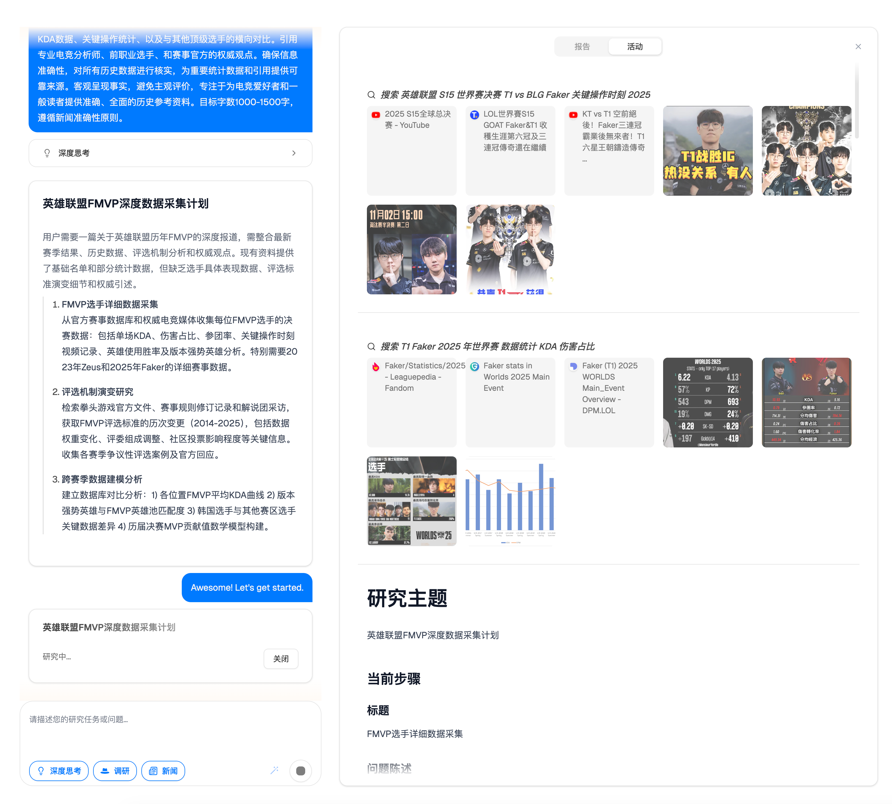
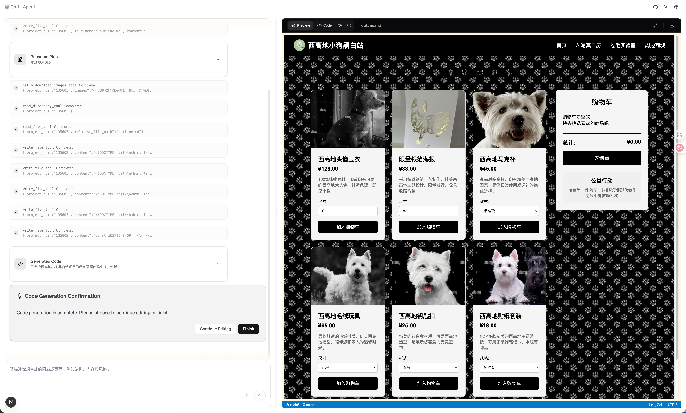

# Craft-Agent

> 📺 **Craft-Agent** 是一个集「深度研究助手」与「网站生成」于一体的智能体系统，基于大语言模型、多智能体编排与现代 Web 技术栈构建。

- 深度研究：自动规划、搜索、阅读与整理资料，生成结构化研究报告
- 网站生成：将研究成果或你的想法，一键转化为可预览的前端网站
- 现代前后端架构：FastAPI + LangGraph/LangChain 后端，Next.js + TypeScript + shadcn/ui 前端

---

## 功能特性

- **多步深度研究工作流**  
  - 自动规划研究步骤，按步骤检索/阅读/汇总信息  
  - 支持人类在环（Human-in-the-loop）微调研究计划与重点

- **网站生成（Web Dev）**  
  - 在 Web Dev 页面描述你想要的网站结构、内容和风格  
  - 后端根据指令生成项目结构与源代码  
  - 前端支持代码查看与本地预览集成

- **工具与集成能力**  
  - 内置网页爬虫（基于 Jina + Readability）
  - Python 代码执行工具

- **现代 Web 体验**  
  - Next.js 15 + React 19 + TypeScript  
  - TailwindCSS + shadcn/ui + 动画效果  
  - 中英文多语言支持（`web/messages/en.json`、`web/messages/zh.json`）

---

## 项目结构总览

核心目录（简化）：

- `src/`
  - `server/app.py`：FastAPI 主应用与 API 入口
  - `graph/`：基于 LangGraph 的工作流状态与节点
    - `State.py`：深度研究与网站生成的状态定义
    - `nodes/`：研究规划、人类反馈等节点逻辑
  - `tools/`：爬虫等 LangChain 工具封装
  - `crawler/`：网页抓取与可读内容抽取
  - `prompts/`：系统提示词（如协调器、规划器等）
- `web/`
  - `src/app/`：Next.js App Router 页面
    - `/chat`：研究工作室界面
    - `/web-dev`：网站生成工作台
    - `/landing`：落地页
  - `src/components/`：通用 UI 组件与 Craft-Agent 交互组件
  - `src/core/`：前端状态管理、配置、API 调用等
  - `messages/*.json`：中英文文案

> **说明**：本 README 只给出高层结构，细节以代码为准。

---

## 后端（Python / FastAPI）

后端基于 FastAPI 构建，暴露一组以 `/api` 开头的接口，用于：

- 拉取配置（模型、RAG、工具等）
- 流式深度研究对话
- 流式网站生成
- 提供生成项目的静态预览（挂载在 `/api/preview`）


---

## 环境要求

- **Python**：建议 Python 3.11+（使用 [uv](https://github.com/astral-sh/uv) 管理依赖与运行）
- **Node.js**：建议 Node.js 18+（`web/package.json` 中当前为 22.14.0+）
- **包管理器**：
  - 后端：`uv`（遵循你的项目规则）
  - 前端：`pnpm`（见 `web/package.json`）

---

## 快速开始

### 方式一：Docker Compose（推荐）

最简单的部署方式，一条命令启动前后端：

```bash
# 克隆仓库
git clone https://github.com/ipvoov/Craft-Agent
cd Craft-Agent

# 配置环境变量
cp .env.example .env
cp conf.yaml.example conf.yaml

# 编辑 .env 和 conf.yaml，添加你的 API 密钥

# 启动服务
docker-compose up -d

# 查看日志
docker-compose logs -f

# 停止服务
docker-compose down
```

**访问地址：**
- 前端：http://localhost:3001
- 后端 API：http://localhost:8001

**镜像信息：**
- 前端镜像：`pveev/craft-agent-frontend:latest`
- 后端镜像：`pveev/craft-agent-backend:latest`

> 如需修改端口，编辑 `docker-compose.yml` 中的 `ports` 配置

---

### 方式二：本地开发（需要 uv）

适合开发者本地调试和扩展：

```bash
# 克隆仓库
git clone https://github.com/ipvoov/Craft-Agent
cd Craft-Agent

# 安装依赖，uv 将负责 Python 解释器和虚拟环境的创建
uv sync

# 配置环境变量
cp .env.example .env
cp conf.yaml.example conf.yaml

# 编辑 .env 和 conf.yaml，添加你的 API 密钥

# 安装前端依赖
cd web && pnpm install

# 启动前后端服务
./start.sh

# 停止服务
./stop.sh
# 或按 Ctrl+C
```

**访问地址：**
- 前端：http://localhost:3001
- 后端 API：http://localhost:8001

---

## 典型使用路径

### 1. 深度研究（Research Studio）

1. 打开 `http://localhost:3001/chat`
2. 选择语言（中/英）
3. 在输入框中描述你的研究问题
4. 可选：开启深度思考模式 / 调研模式
5. 等待系统规划并执行多步研究，最后生成结构化报告

### 2. 网站生成（Web Dev）

1. 打开 `http://localhost:3001/web-dev`
2. 用自然语言描述你想要的网站（例如：结构、页面、文案风格）
3. 提交后端会生成对应的项目结构与代码
4. 在右侧代码区域查看生成结果，并使用内置预览功能进行预览

---

## 架构图

### 深度研究工作流架构

<p align="center">
  
</p>

### 网站生成工作流架构

<p align="center">
  
</p>

## 界面示例

### 深度研究页面

<p align="center">
  
</p>

### 网站生成页面

<p align="center">
  
</p>

---

## 开发与扩展

- **Graph / Agent 工作流**：
  - 在 `src/graph/` 中可以调整状态定义 (`State.py`) 与各节点行为
  - 可根据业务需要添加新的工具节点或工作流分支

- **工具扩展**：
  - 在 `src/tools/` 目录中添加新的 LangChain 工具
  - 通过配置接入更多第三方 API（如搜索、数据库、内部系统）

- **MCP 服务器配置**：
  - 前端设置页支持通过 JSON 配置注册 MCP 服务器
  - 对应文案见 `web/messages/en.json` / `zh.json` 的 `settings.mcp` 段落

> 请严格避免在仓库中提交任何 API Key、密码等敏感信息。

---

## 部署指南

### Docker Compose 部署（生产环境）

本项目已优化 Docker 镜像体积，使用多阶段构建和轻量级基础镜像：

**镜像优化：**
- 前端：使用 `distroless/nodejs20-debian12`，体积约 200-300MB
- 后端：使用 `python:3.13-slim`，体积约 500-700MB

**部署步骤：**

1. **配置环境**
   ```bash
   cp .env.example .env
   cp conf.yaml.example conf.yaml
   # 编辑 .env 和 conf.yaml，添加必要的 API 密钥
   ```

2. **启动服务**
   ```bash
   docker-compose up -d
   ```

3. **验证服务**
   ```bash
   # 检查容器状态
   docker-compose ps
   
   # 查看日志
   docker-compose logs -f backend
   docker-compose logs -f frontend
   ```

4. **停止服务**
   ```bash
   docker-compose down
   ```

**网络配置：**
- 前后端通过 `craft-network` 桥接网络通信
- 前端通过 `http://localhost:8001` 访问后端 API
- 浏览器访问 `http://localhost:3001`

---

### 云服务部署

#### Vercel（前端）
```bash
cd web
vercel deploy --prod
```

#### 云服务器（Docker）
```bash
# 登录 Docker Hub
docker login

# 拉取镜像
docker pull pveev/craft-agent-backend:latest
docker pull pveev/craft-agent-frontend:latest

# 使用 docker-compose 启动
docker-compose up -d
```

#### 自建服务器（Python + Node.js）
参考「方式二：本地开发」的安装步骤

---

### 环境变量配置

**后端 (.env)：**
```env
# LLM 配置
OPENAI_API_KEY=your_key_here
OPENAI_BASE_URL=https://api.openai.com/v1

# 其他配置
ENABLE_PYTHON_REPL=false
```

**前端 (docker-compose.yml)：**
```yaml
NEXT_PUBLIC_API_URL: "http://localhost:8001"  # 本地开发
# 生产环境改为实际域名
NEXT_PUBLIC_API_URL: "https://api.yourdomain.com"
```

---

## 故障排查

### 前端无法连接后端

**症状：** 前端请求返回 404 或连接超时

**解决方案：**
1. 检查 `docker-compose.yml` 中的 `NEXT_PUBLIC_API_URL` 是否正确
2. 确保后端容器正在运行：`docker-compose ps`
3. 检查后端日志：`docker-compose logs backend`
4. 验证网络连接：`docker network ls`

### 镜像拉取失败

**症状：** `docker pull` 超时或 404

**解决方案：**
1. 检查网络连接
2. 确认镜像名称正确：`pveev/craft-agent-backend:latest`
3. 尝试手动登录 Docker Hub：`docker login`

### 容器内存占用过高

**症状：** 容器频繁重启或 OOM

**解决方案：**
1. 增加 Docker 内存限制
2. 检查后端日志中的错误信息
3. 优化 LLM 模型配置

---

## 贡献指南

欢迎提交 Issue 和 Pull Request！

1. Fork 本仓库
2. 创建特性分支：`git checkout -b feature/your-feature`
3. 提交更改：`git commit -am 'Add new feature'`
4. 推送到分支：`git push origin feature/your-feature`
5. 提交 Pull Request

---

## 许可证

MIT License - 详见 [LICENSE](LICENSE) 文件

---

## 联系方式

- GitHub Issues：[提交问题](https://github.com/ipvoov/Craft-Agent/issues)
- 讨论区：[GitHub Discussions](https://github.com/ipvoov/Craft-Agent/discussions)

---
